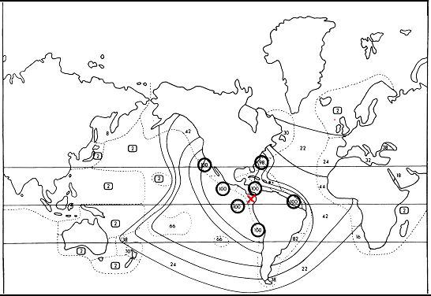

```{r setup, include=FALSE}
knitr::opts_chunk$set(echo = TRUE)
```

# Introduction

This package consists of several functions to make working with null models for community analysis more convenient. The models demonstrated in this vignette were initially developed to test concepts of community assembly, and mainly to test if the co-occurrence of species was greater or less than expected by chance. Several $\beta$-diversity indices are based on co-occurrence of species, but are influenced by differences in $\alpha$- and $\gamma$-diversity. The null models referred to in this document allow comparing observed and expected $\beta$-diversities if $\alpha$- and $\gamma$-diversities could be held constant or at least nearly so.  

The general procedure is to compare a statistic such as the Jaccard dissimilarity for two samples to a distribution of the statistic calculated by repeatedly randomizing the community matrix and calculating the statistic for each iteration of the randomization. Because the algorithms for randomizing the community matrix constrain matrix attributes related to $\alpha$- and $\gamma$- diversity in a meaningful way only for presence/absence data, we are limited to comparing statistics based on presence/absence data. These include the Jaccard, Sorenson and Raup-Crick indices.  

# Randomization Methods

For completeness, I have included nine functions from Gotelli's *EcoSimR* scripts *EcoSimR* is currently under development at https://github.com/GotelliLab/EcoSimR); these are `Sim1` through `Sim8` and `Sim10`. These all start with a matrix of zero's and insert one's in various ways. `Sim9` is not included because it cannot be generated in this way. In *EcoSimR* samples are in columns and species are in rows, just the opposite of *vegan*'s convention. I have not altered Gotelli's scripts to conform to the *vegan* standard. The functions are not compiled code, but are still relatively fast because thy make use of apply rather than for loops.   

Of Gotelli's functions, we will make greatest use of `Sim4`. This function shuffles elements within each row, thus maintaining row sums ($\alpha$-diversity if the matrix has samples as rows). Sampling weights for each column are proportional to column sums. This constrains species occurrences but does not strictly maintain them. I have made a modification to `Sim4` that I named `randomize_by_rows`; it allows the user to specify sampling weights different from column sums of the matrix being randomized. `Sim2` is a related function that also shuffles elements within rows, but column probabilities (weights) are equal. Examples of each of these methods follow, using the example community matrix `com`.  

```{r}
suppressPackageStartupMessages(library(QsNullModels))
data(com)
com
rowSums(com)
colSums(com)
sum(colSums(com)>0)
sum(com)
```

Now randomize com using the function `Sim4`:

```{r}
set.seed(1)
a <- Sim4(com)
a
rowSums(a)
colSums(a)
sum(colSums(a)>0)
sum(a)
```

Notice that the row sums ($\alpha$-diversity), and the total of the matrix `a` are the same as for `com`. The number of columns with sums greater than 0 ($\gamma$-diversity), is also the same or at least close, because the sampling weights are the column sums of `com`. That is, every species in `com` has a chance of being included in `a`. The column sums (species occurrences), however, are likely different from the column sums of `com`. 

Now, randomize `com` using `randomize_by_rows` with an arbitrary sampling weight vector `w`. From the column sums of `com`, I change the weight for species 1 to 30 and the weight for species 2 to 0. I do this only as an example. The reason one would want to specify sampling weights will become clear later in this document.  

```{r}
set.seed(1)
w <- c(30,0,3,2,3,1,3,3,2,1)
b <- randomize_by_rows(com, w, rename=TRUE)
b
rowSums(b)
colSums(b)
sum(colSums(b)>0)
sum(b)
```

Compare the attributes of `b` to those of `com`. Because the weight given to species 1 was so high, it is likely included in every sample, and because the weight assigned to species 2 was 0, it is now absent in every sample. This obviously changes the column sums, but the row sums are the same as for `com`.  

Compare the results when `Sim2` is used for the randomization. Only row (sample) totals are maintained.  Species are sampled equiprobably.  

```{r}
set.seed(1)
c <- Sim2(com)
c
rowSums(c)
colSums(c)
sum(colSums(c)>0)
sum(c)
```

Sample (row) sums and the matrix total are strictly maintained, but species occurrences and sums are not. The number of non-empty species can also be different from that of `com`.  

The R package `picante` includes the matrix randomization function `randomizeMatrix` with several methods selected by its argument `null.model`. Setting `null.model` to ``r0'' corresponds to method `Sim2` while setting it to method ``r1'' corresponds to method `Sim4`. Setting `null.model` to i`ndependentswap` follows Gotelli's (2000) `Sim9` algorithm and maintains both sample richness and species occurrence frequency. Setting `null.model` to `trialswap` achieves the same result using an algorithm that may introduce less bias (Miklos & Podani, 2004). These methods are fast because they are implemented in C.   

```{r}
library(picante)
set.seed(1)
d <- randomizeMatrix(com, null.model="independentswap")
d
rowSums(d)
colSums(d)
sum(colSums(d)>0)
sum(d)

e <- randomizeMatrix(com, null.model="trialswap")
e
rowSums(e)
colSums(e)
sum(colSums(e)>0)
sum(e)
```

# Raup-Crick

The paleontologists Raup and Crick (1979) originally proposed their probabilistic index of similarity as a statistical test of whether similarities or dissimilarities between two faunal lists were significantly different. They used a null model approach to compare the observed number of shared species with the expected number of shared species assuming the species were distributed randomly. Figure 1 displays an example from their paper. For lists of extant echinoids at 40 sites, similarity to site X off the Pacific coast of Central America decreased with distance but was significantly ($\alpha$ = 0.05) less only in the western Pacific.  

```{r, echo = FALSE, fig.align='left', fig.cap="Figure 1. Analysis of echinoid biogeographic data. Dotted outlines separate the sampling areas: the numbers indicate the INDEX OF SIMILARITY of each area with respect to an arbitrarily chosen reference area (marked with a red X : Pacific coast of Central America). Numbers enclosed in circles indicate significant similarity to the reference area; numbers in boxes indicate significant dissimilarity to the reference area. Intermediate values of the INDEX are contoured. From Raup & Crick, 1979."}

```

Raup and Crick (1979) calculated their index of similarity by first randomizing the binary community matrix using the same algorithm as functions `Sim4` and `randomizeMatrix` with `null.model= "r1."` From the randomizations, they generated a distribution of the expected number of shared species, $k_{exp}$. The index of similarity was was initially defined as the proportion of $k_{exp}$ values less than or equal to the observed number of shared species, $k_{obs}$.  This, however, leads to overestimating similarity when there are many $k_{exp}$ values tied with $k_{obs}$. This is especially a problem when one of the samples being compared has markedly fewer species, which limits the values $k_{exp}$ can take. To solve this problem, Raup and Crick adopted the arbitrary convention of defining similarity as the proportion of times $k_{exp}$ was less than $k_{obs}$ plus one-half of the proportion of times $k_{exp}$ equaled $k_{obs}$. This is referred to as ``splitting ties'' when describing how the Raup-Crick index is calculated.  

Chase (2010) used a modified version of the Raup-Crick index in an NMDS ordination of the communities in ponds of differing productivity. The modifications consisted of using the independent swap algorithm to generate the null distribution, not splitting ties, and conversion to dissimilarity by taking the complement. Points for ponds of low productivity clustered closer together (i.e. were more similar in composition) than points for ponds of medium and high productivity. Chase then made the statement that, "Communities that are closer together are more deviant from the null expectation, whereas communities that are farther apart are less deviant from the null expectation," a statement parroted by Zhou et al. (2014). While this may have been true for Chase's data, it should not be considered generally true. Whether a community is more or less deviant from null expectation does not depend on the value of the observed statistic, but rather on the position of the observed statistic in the distribution of the expected (null) statistic. Points plotting farther apart may represent communities that are more dissimilar than expected by chance, that is, also (more) deviant from null expectation. Chase's statement is therefore conceptually erroneous.   

Chase et al. (2011) corrected this error in a later paper, using a differently modified Raup-Crick metric. This time they generated the null distribution using the `r1` randomization algorithm and split ties, converted to a dissimilarity, and then re-scaled the result to the interval -1 to 1 (by subtracting 0.5 and then multiplying by 2). They then explained that, "A value of 0 represents no difference in the observed (dis)similarity from the null expectation; a value of 1 indicates observed dissimilarity higher than the expected in any of the simulations (communities completely more different from each other than expected by chance), and vice versa for a value of -1 (communities completely less different [more similar] than expected by chance)." So, they acknowledged that a value of 1 (corresponding to a value of 1 before re-scaling) meant communities were more different than expected by chance.  

# Calculating the Raup-Crick Index

There are several R functions available for calculating the Raup-Crick index. Function `raup_crick` in this package is taken from the R script given in the supplementary material to Chase et al. (2011). The script is slow to run, and I have provided my own function `my_rc` altered to improve speed. Since version 2.0-1, `vegan` has included the function `raupcrick` which also calculates the index, as a distance, via null model simulations, but does not directly offer the option of splitting ties. The documentation for `raupcrick` explains the effect of the logical argument `chase`. The default value is `chase=FALSE`, in which case the function returns values as the proportion of simulations for which the number of shared species is less than or equal to the observed number of shared species. If `chase=TRUE` (not recommended by `vegan` maintainer Jari Oksanen), values returned are the proportions of simulations for which the number of shared species is smaller than the observed number of shared species, the same as for the Chase script (function `raup_crick`) with argument `split=FALSE` (which Raup and Crick (1979) did not recommend). Distances based on splitting ties can be obtained with the `vegan` function `raupcrick` by averaging the results with `chase=TRUE`  and `chase=FALS`E. 

Chase's function `raup_crick`, as a distance and splitting ties:  

```{r}
set.seed(1)
raup_crick(com, classic_metric=TRUE)
```

My function, as a distance and splitting ties:  

```{r}
set.seed(1)
my_rc(com)
```

Vegan's `raupcrick`, chase = T and F and average to get values based on splitting ties:  

```{r}
set.seed(1)
rc.t <- raupcrick(com, chase=TRUE)
rc.t
set.seed(1)
rc.f <- raupcrick(com, chase=FALSE)
rc.f
(rc.t + rc.f)/2
```

Compare run times (100 replications, using the dune community data from the vegan package):

```{r}
data(dune)
# Chase's R script:
system.time(replicate(100,(raup_crick(dune, classic_metric=TRUE))))
# My function:
system.time(replicate(100, my_rc(dune)))
# Average vegan fucntion with chase=T & F
f <- function(x) {raupcrick(x, chase=TRUE)+raupcrick(x, chase=FALSE)/2}
system.time(replicate(100, f(dune)))
```

If the goal is to get distances based on splitting ties, my function is fastest by a small margin. Otherwise the `vegan` function is fastest - you would have to run it only once. Still, these functions are relatively slow. For example, to calculate distances for a community matrix of 15 samples and 3,448 species took my function 55 seconds, elapsed time.

`Vegan`'s `vegdist` function includes a method "`raup`." It does not generate a distribution of shared species by randomizing the community matrix, but instead  uses a theoretical (hyper-geometric) distribution and weights species equiprobably. It should give results comparable to the `vegan` `raupcrick` function with argument `null= "r0"` which specifies equal sampling probabilities and with argument `chase=FALSE`.   

```{r}
vegdist(com, "raup")
set.seed(1)
raupcrick(com, null="r0", nsimul=999, chase=FALSE)
```

# Comparing Observed and Expected Statistics
## oecosimu
The `vegan` function `oecosimu` is a wrapper that evaluates an observed statistic against a distribution of the statistic generated from null model simulation. As one example, the `raupcrick` function is actually calculated using `oecosimu`. As another example, `oecosimu` may be used to easily determine if the mean distance for a community matrix is different from null model expectation. To do this, first define a function to calculate the mean distance, and then use `oecosimu` to replicate the function using a specified randomization method. Test results are returned. 

As an exercise, sub-set the Hay pasture treatment from the dune community data and test if the mean Jaccard distance is different from null model expectation. Randomize 999 times using the ``r1'' algorithm which samples using species occurrences as probabilities and maintains site totals.  


```{r}
data(dune)
data(dune.env)
com.hp <- dune[dune.env$Use=="Haypastu", ]
com.hp <- decostand(com.hp, "pa")
mean.jac <- function(x) mean(vegdist(x, "jac", binary=TRUE))
set.seed(1)
rslt <- oecosimu(com.hp, mean.jac, nsimul=999, "r1")
rslt
```

In the output, ``statistic'' is the observed mean Jaccard distance and ``mean'' is the expected mean Jaccard distance based on the null model. ``z'' is the standard effect size (SES) calculated as the observed statistic minus the expected statistic and then divided by the standard deviation of the expected statistic. ``Pr(sim.)'' is the probability that there is no difference between the observed and expected statistics ($\alpha$ level).  

For use with `oecosimu`, the recommended algorithm to randomize binary matrices maintaining both sample and species totals is `quasiswap` (Miklos \& Podani, 2004). Repeat the above using `quasiswap` as the randomization method.  

```{r}
set.seed(1)
rslt <- oecosimu(com.hp, mean.jac, nsimul=999, "quasiswap")
rslt
```

## perm_disper

In Zhou et al. (2014) a different method was used to compare observed and expected distances for a treatment. Ye Deng performed most of the statistical analyses in Zhou et al. (2014) and shared one of his R scripts with me.  For each iteration of a randomization, the original matrix and randomized matrix were joined by rows (samples), a distance calculated on the combined matrix, the two matrices defined as groups, and `vegan`'s `betadisper` function used to test for differences in dispersion between the two groups. I created the function `perm_disper` based on Ye Deng's R script to automate this process, using the Jaccard distance as the test statistic. It makes use of `randomize_by_rows` and takes a vector of sampling weights as argument `w`. Calculating `w` as the column sums of the community matrix sub-set to a treatment corresponds to Ye Deng's `gamma.method=group`. Calculating `w` as the column sums of the community matrix containing all treatments corresponds to Ye Deng's `gamma.method=total`. The result of `perm_disper` is a `betadisper` object, so it has the same summary and plot functions.  

First, perform the test for the Hay pasture samples using `gamma.method=total`.

```{r}
dune.pa <- decostand(dune, "pa")
weights <- colSums(dune.pa)
set.seed(1)
rslt <- perm_disper(com.hp, w=weights)
rslt
anova(rslt)
```

There is no difference in dispersion between the two groups.   

Note: Pay attention to the eigenvalues. If they exist and are large enough, negative eigenvalues will adversely affect the results. 

Make a box plot of the results (Figure 2).  

```{r, echo=FALSE, fig.align='left', fig.cap="Figure 2. Results of the `perm_disper` test for the Hay Pasture samples using Jaccard distances and `gamma.method=total'"}
boxplot(rslt)
```

You can also make a simple ordination plot for the two groups (Figure 3).  

```{r, echo=FALSE, fig.align="left", fig.cap="Figure 3. Ordination based on the `perm_disper` test for the Hay Pasture samples using Jaccard distances and `gamma.method=total`. For the null model, one sample appears an outlier."}
plot(rslt)
```

Repeat the dispersion test using `gamma.method=group`.  

```{r}
weights <- colSums(com.hp)
set.seed(1)
rslt <- perm_disper(com.hp, w=weights)
rslt
anova(rslt)
```

# Simberloff's Species Lists

Raup and Crick developed their metric to compare two samples in a probabilistic way. They sought to answer the question: what is the probability that two samples differ in community structure (as assessed by shared species)? In discussing their approach, they compared it to Simberloff's in his 1978 paper. Simberloff used the same kind of null models, but had in mind a different question: does the total distribution of species on islands differ significantly from that expected from the null hypothesis of random sprinkling?  

Simberloff summarized his findings with statements as to how many times observed shared species were greater or lesser than expected shared species, and how many of those comparisons were significantly different. This information can be parsed from an `oecosimu` result if the test is for binary data and the statistic is shared species. To make such a summary easier, I wrote several functions. Function `shared_spp` calculates the number of species shared between samples in a community matrix with samples as rows and species as columns. Function `mean_shared_spp` calculates the mean number of shared species observed for all sample pairs. Function `simberloff_sum` summarizes the results of an `oecosimu` result when the statistic is shared species. As an example, run: 

```{r}
library(vegan)
data(sipoo)
set.seed(1)
rslt <- oecosimu(sipoo, shared_spp, nsimul=999, "r1")
rslt.sum <- format_oecosimu_vector(rslt, sipoo)
simberloff_sum(rslt.sum, alpha=0.05)
```

The observed number of shared species is more often greater than the expected number (132 out of 153 sample pairs), significantly so 27 times.  

But it seems to me that what we are really interested in is the overall difference between the number of observed and expected shared species, that is the mean difference for all sample pairs. In this case, run the test for mean shared species, thus:

```{r}
set.seed(1)
rslt <- oecosimu(sipoo, mean_shared_spp, nsimul=999, "r1")
rslt
```

Considering all pairwise sample combinations, the mean of the observed number of shared species is significantly greater than the mean of the expected number of shared species.  

# References

Chase, J. M. 2010. Stochastic community assembly causes higher biodiversity in more productive environments. Science 328:1388-1391.  

Chase, J. M., N. J. B. Kraft, K. G. Smith, M. Vellend, and B. D. Inouye. 2011. Using null models to disentangle variation in community dissimilarity from variation in alpha-diversity. Ecosphere 2.  

Gotelli, N. J., and G. L. Entsminger. 1999. EcoSim. Null models software for ecology. Version 3.0. Acquired Intelligence Incorporated, and Kesey-Bear.  

Gotelli, N. J. 2000. Null model analysis of species co-occurrence patterns. Ecology 81:2606-2621.  

Miklos, I., and J. Podani. 2004. Randomization of presence-absence matrices: Comments and new algorithms. Ecology 85:86-92.  

Raup, D. M., and R. E. Crick. 1979. Measurement of faunal similarity in paleontology. Journal of Paleontology 53:1213-1227.  

Simberloff, D. 1978. Using island biogeographic distributions to determine if colonizatioon is stochastic. American Naturalist 112:713-726.  

Zhou, J. Z., Y. Deng, P. Zhang, K. Xue, Y. T. Liang, J. D. Van Nostrand, Y. F. Yang, Z. L. He, L. Y. Wu, D. A. Stahl, T. C. Hazen, J. M. Tiedje, and A. P. Arkin. 2014. Stochasticity, succession, and environmental perturbations in a fluidic ecosystem. Proceedings of the National Academy of Sciences of the United States of America 111:E836-E845.  

